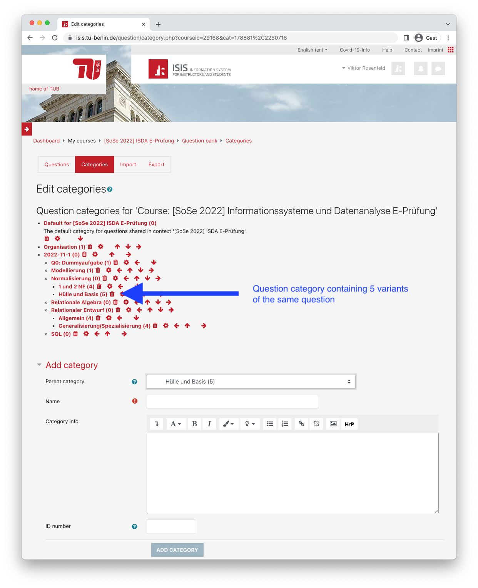
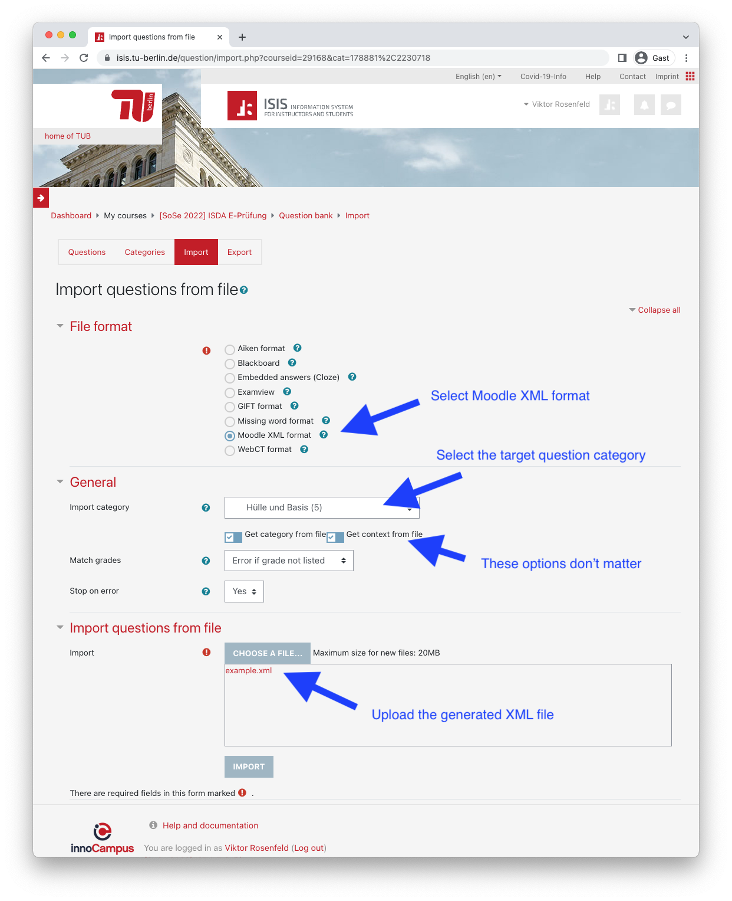
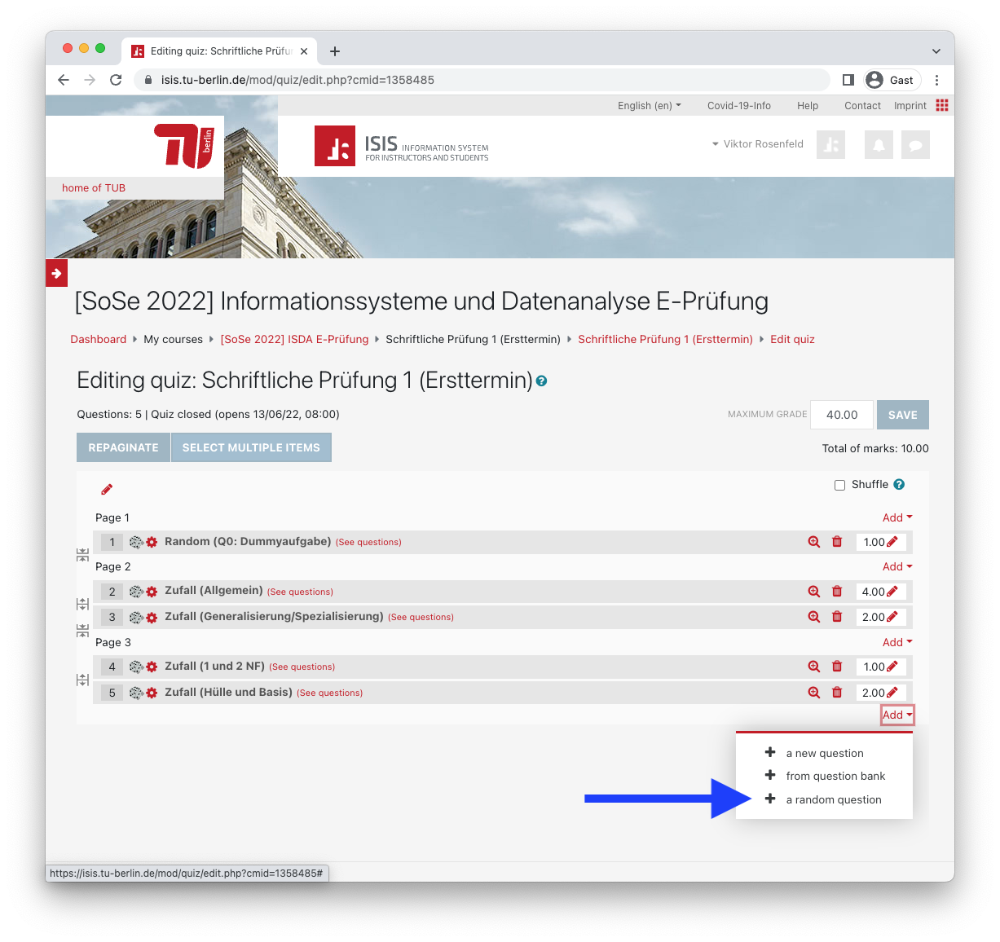
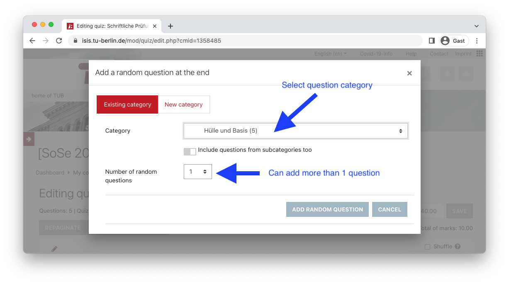
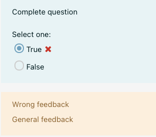
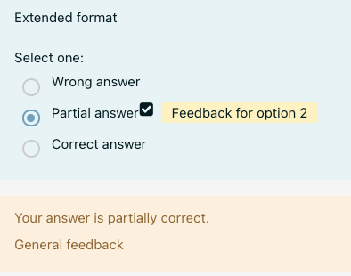
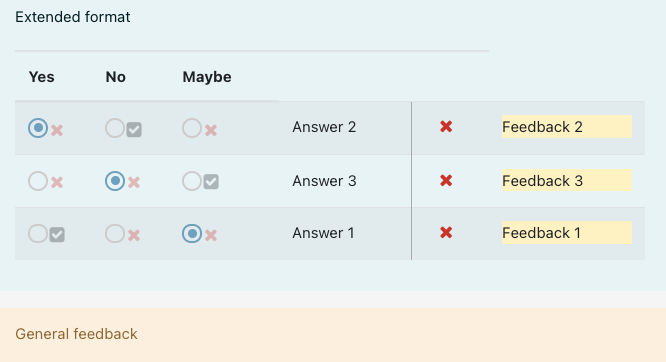

# Generate Moodle quiz questions

This tool allows the generation of multiple questions (of the same type) from a single YAML document. 
The questions can be imported into a question category in Moodle.
We can then create a quiz entry which randomly selects a question from the question category.

- [Workflow](#workflow)
- [Question types](#question-types)
- [Command line usage](#command-line-usage)

# Workflow

## Step 1: Create question category

The variants of a single question should all go into a dedicated question category.

Best practice is to create a top-level category for each quiz (`2022-T1-1` in the screenshot), then a subcategory which groups similar questions (e.g., `Normalisierung`), and then the question categories as the third level (e.g., `Hülle und Basis`.)



## Step 2: Create a YAML document with questions

Moodle quiz questions are generated from YAML files.
In a later step, these are converted to Moodle XML and then imported into the question category.

The format of these YAML file depends on the question type and is described below.

The variants for a single question can be collected into a single YAML file.
(It is also to possible to use multiple YAML files.)

In the example below, there are two question variants for a multiple true/false question, and each variant is separated by three dashes `---`.

Store the following YAML contents in a file `example.yml`:

```yaml
---
question: |
  <p>
  Welche der folgenden Operationen gehören zu den Basisoperatoren der Relationalen Algebra?
  </p>
title: Relationale Algebra 1
answers:
  - answer: Projektion
    choice: True
  - answer: Division
    choice: False
  - answer: Natürlicher Join
    choice: False
---
question: |
  <p>
  Welche der folgenden Operationen gehören zu den Basisoperatoren der Relationalen Algebra?
  </p>
title: Relationale Algebra 2
answers:
  - answer: Differenz
    choice: True
  - answer: Vereinigung
    choice: True
  - answer: Schnitt
    choice: False
```

## Step 3: Convert the YAML files to Moodle XML

Since the question variants in the example above multiple true/false questions, we use the `multiple_true_false` question type:

```bash
python3 -m moodle_tools.make_questions multiple_true_false < example.yml > example.xml
```

## Step 4: Import the questions into Moodle

Import the generated Moodle XML into the question category.
The questions that are already in the question category remain unchanged.
This means, that if you want to update your questions, you should first delete the old questions in the category.



## Step 5: Add the questions to a Moodle quiz.

To use the question variants in the quiz, add a random question from the question category.
It is possible to use more than one question variant.






# Question types

At the moment, three question types are supported.

- Simple true/false questions
- Multiple choice questions with a single selection
- Multiple true/false questions

Multiple question variants can be collected in a single YAML document.
In this case, each question variant is separated by three dashes `---`.
However, all question variants in a single document must be of the same question type.

## Simple true/false questions

This question type specifies a simple true/false question.

The full YAML format for such a question is as follows:

```yaml
statement: "Complete question"
title: "Question title"
correct_answer: false
general_feedback: "General feedback"
correct_feedback: "Correct feedback"
wrong_feedback: "Wrong feedback"
```

This YAML content is rendered as follows in Moodle:



It is possible to shorten the specification to only include the question text and the correct answer:

```yaml
statement: "Minimal false question"
correct_answer: false
```

Furthermore, if the correct answer is true, it is possible to shorten the specification even more:

```yaml
statement: "Minimal true question"
```

## Multiple choice questions with a single selection

This question type specifies a multiple choice question in which the student can only select one answer.
Moodle renders a radio button next to each answer.

The full YAML format for such a question is as follows:

```yaml
question: Extended format
title: Question title
general_feedback: General feedback
answers:
  - answer: Correct answer
    points: 100
    feedback: Feedback for option 1
  - answer: Partial answer
    points: 50
    feedback: Feedback for option 2
  - answer: Wrong answer
    points: 0
    feedback: Feedback for option 3
```

This YAML content is rendered as follows in Moodle:



As the example shows, it is possible to assign a number of points for each answer.
100 points indicate a correct answer and 0 points a wrong answer; anything in between is partial credit.

It is possible to shorten the specification to only include the question text and the answer text.
The first answer is assumed to be correct (100 points), the remaining answers are assumed to be false (0 points).

```yaml
question: Simple format
answers:
  - Correct answer 1
  - Wrong answer 1
  - Wrong answer 2
```

## Multiple true/false questions

This question types specifies a question which contains multiple answers.
For each answer, the student has to indicate whether it is true of false.

This question should be used instead of specifying a multiple choice question with multiple correct answers.
(Moodle would render those using checkboxes, allowing the student to select multiple answers.)
The reason is that the examination guidelines do not allow us to subtract points for false answers.
Therefore, students could simply select all possible answers and get full credit.
This strategy is not possible with this question type.

The full YAML format for such a question is as follows:

```yaml
question: Full format
title: Question title
general_feedback: General Feedback
answers:
  - answer: Answer 1
    choice: True
    feedback: Feedback 1
  - answer: Answer 2
    choice: False
    feedback: Feedback 2
```

It is possible to shorten the specification to only include the question text and the answers.

```yaml
question: Simple format
answers:
  - answer: Answer 1
    choice: True
  - answer: Answer 2
    choice: False
```

It is also possible to rename the choices.
The default choices are `True` and `False`.
The example below uses `Ascending` and `Descending` instead.

```yaml
title: Memory hierarchy
question: For each category, say descending or ascending
choices: [Ascending, Descending]
answers:
  - answer: Cost
    choice: Ascending
  - answer: Latency
    choice: Descending
```

It is also possible to specify more than two choices.
The example below uses three choices.
Note that `Yes` and `No` are escaped with `!!str`.
Without the escape, the YAML parser would treat them as `True` and `False`.

```yaml
question: Extended format
general_feedback: General feedback
choices: [!!str Yes, !!str No, Maybe]
answers:
  - answer: Answer 1
    choice: !!str Yes
    feedback: Feedback 1
  - answer: Answer 2
    choice: !!str No
    feedback: Feedback 2
  - answer: Answer 3
    choice: Maybe
    feedback: Feedback 3
```

This YAML content is rendered as follows in Moodle:



# Command line usage

You can get usage information with the following command:

```bash
python3 -m moodle_tools.make_questions -h
```

Output:

```
usage: make_questions.py [-h] [-i INPUT] [-o OUTPUT] [-t TITLE] {true_false,multiple_true_false,multiple_choice} ...

options:
  -h, --help            show this help message and exit
  -i INPUT, --input INPUT
                        Input file (default stdin).
  -o OUTPUT, --output OUTPUT
                        Output file (default stdout).
  -t TITLE, --title TITLE
                        Default question title (default: Knowledge question).
  -l, --lenient         Skip strict validation.
  --add-question-index  Extend each question title with an increasing number.

Possible commands:
  {true_false,multiple_true_false,multiple_choice}
    true_false          Generate Moodle XML for a true/false question.
    multiple_true_false
                        Generate Moodle XML for a multiple true/false question.
    multiple_choice     Generate Moodle XML for a multiple choice question with a single answer.

```

First the user specifies options that modify the XML generation process.
Then the user specifies the question type, i.e., `true_false` , `multiple_true_false`, `multiple_choice`

## Input / output handling

The input YAML and output XML file are specified with `-i` and `-o`, respectively.
It is also possible to use shell redirection.

## Question titles and numbers

Each question can specify the question title in the YAML format using the key `title`.
If now question title is given, the generated XML file with contain the title specified with the command line option `--title`.
The default title is `Knowledge question`.

It is possible to automatically number each question in a YAML file with the command line switch `--add-question-index`.

## Strict validation

This tool performs some validation on the specified question.
The exact check depend on the question type.
In general, the tool checks if there is general feedback, and if each wrong answer has feedback.
Feedback makes the review process easier because students will (hopefully) not ask why they got a question wrong.

If this validation process fails, an error message is printed on standard out and the question is not converted to XML.

You can disable strict validation with the command line switch `--lenient`.

## Inline images

Images specified in question and answer texts will be inlined in the exported XML document.
This way, we don't have to manually upload images using the Moodle web interface.

The inlining process checks for the following regular expression:

```

```

The `alt` tag (the image description) is mandatory.
You should use a different description for every image.
That is because the contents of the `alt` tag are used when exporting the quiz responses.
If two questions or two answers just differ in the used image but not in the used text, it is not possible to distinguish the questions and/or answers when analyzing the responses.
However, if each image uses a different description, then the image description can be used to distinguish the text.

Inlining can theoretically lead to an XML file that exceeds the 20 MB file size limit.
In this case, you should reduce the file size of the images.
The images are encoded in base64, so the encoded size is larger than the actual file size.
