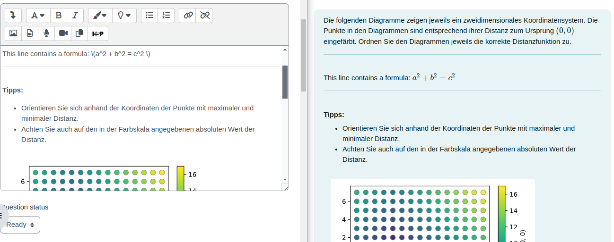

# Generate Moodle Quiz Questions

This tool allows the generation of (multiple) Moodle quiz questions (of the same type) from a single YAML document.
The questions can be imported into a YAML-defined or individually selected question category in Moodle.
We can then create a quiz entry which randomly selects a question from the question category.

- [Workflow](#workflow)
- [Question types](#question-types)
- [Command line usage](#command-line-usage)

## Workflow

### Step 0 (optional): Create a question category

The variants of a single question should all go into a dedicated question category.

Best practice is to create a top-level category for each examination element (e.g., `2022-T1-1` in the screenshot), then a subcategory which groups similar questions (e.g., `Normalisierung`), and then the question categories as the third level (e.g., `Hülle und Basis`.)

**Note:** Creating question categories via the Moodle UI is optional. You can also define question
categories via the YAML keyword `category`. Category hierachies can be specified by separating
categories with a `/`. Note that if you specify a `category` for one question, all following questions
will be added to the same category unless you specify another `category` for them.


### Step 1: Create a YAML document with questions

Moodle quiz questions are generated from YAML files.
In a later step, these are converted to Moodle XML and then imported into the Moodle course.

The format of these YAML file depends on the question type and is described below.

The variants for a single question can be collected into a single YAML file.
(It is also to possible to use multiple YAML files.)

In the example below, there are two question variants for a multiple true/false question, and each variant is separated by three dashes `---`.

Store the following YAML contents in a file `example.yml`:

```yaml
---
type: multiple_true_false
question: |
  <p>
  Welche der folgenden Operationen gehören zu den Basisoperatoren der Relationalen Algebra?
  </p>
title: Relationale Algebra 1
answers:
  - answer: Projektion
    choice: True
  - answer: Division
    choice: False
  - answer: Natürlicher Join
    choice: False
---
question: |
  <p>
  Welche der folgenden Operationen gehören zu den Basisoperatoren der Relationalen Algebra?
  </p>
title: Relationale Algebra 2
answers:
  - answer: Differenz
    choice: True
  - answer: Vereinigung
    choice: True
  - answer: Schnitt
    choice: False
```

### Step 2: Convert the YAML files to Moodle XML

Since the question variants in the example above are multiple true/false questions, we use the
`multiple_true_false` question type:

```bash
make-questions -i example.yml -o example.xml -s
```

### Step 3: Import the questions into Moodle

Import the generated Moodle XML into a Moodle course.
The questions that are already in the question category of your choice remain unchanged.
This means that if you want to update your questions, you should first delete the old questions in the category.


### Step 4: Add the questions to a Moodle quiz

To use your question (variants) in a quiz, add a random question from the question category.
It is possible to use more than one question variant.


## Question Types

At the moment, seven question types are supported.

- Simple true/false questions
- Multiple choice questions with a single selection
- Multiple true/false questions
- Numerical questions
- Missing words questions
- Cloze questions
- CodeRunner SQL-DQL

Multiple question variants can be collected in a single YAML document.
In this case, each question variant is separated by three dashes `---`.

### Simple true/false questions

This question type specifies a simple true/false question.

The full YAML format for such a question is as follows:

```yaml
type: true_false   # Mandatory
category: category/subcategory/true_false    # Optional
title: Question title    # Mandatory
question: Complete question    # Mandatory
correct_answer: false    # Mandatory
general_feedback: General feedback  # Mandatory in strict mode
correct_feedback: Correct feedback  # Mandatory in strict mode
incorrect_feedback: Wrong feedback  # Mandatory in strict mode
```

This YAML content is rendered as follows in Moodle:


It is possible to shorten the specification to only include the question type, the question text, and the correct answer, this requires the skip-strict-mode to be true, either by using the `-s` argument in the CLI or by declaring it in the YAML document:

```yaml
type: true_false
question: "Minimal false question"
correct_answer: false
skip_validation: true   # Optional
```

Furthermore, if the correct answer is true, it is possible to shorten the specification even more:

```yaml
type: true_false
question: "Minimal true question"
```

### Multiple choice questions

This question type specifies a multiple choice question in which the student can only select one answer.
Moodle renders a radio button next to each answer.

Note that the `points` attribute for each answer is optional.
However, it is only valid to specify points for all OR none of the answers within a question.
If you do not specify `points`, the first answer is assumed the correct one and the other are assumed incorrect.

The full YAML format for such a question is as follows:

```yaml
type: multiple_choice  # Mandatory
category: category/subcategory/multiple_choice  # Optional
title: Question title  # Mandatory
question: Extended format  # Mandatory
general_feedback: General feedback  # Mandatory in strict mode
shuffle_answers: True  # Optional
answers:  # Mandatory
  - answer: Correct answer  # Mandatory
    points: 100  # Optional
    feedback: Feedback for option 1  # Mandatory in strict mode
  - answer: Partial answer  # Mandatory
    points: 50  # Optional
    feedback: Feedback for option 2  # Mandatory in strict mode
  - answer: Wrong answer  # Mandatory
    points: 0  # Optional
    feedback: Feedback for option 3  # Mandatory in strict mode
```

This YAML content is rendered as follows in Moodle:


As the example shows, it is possible to assign a number of points for each answer.
100 points indicate a correct answer and 0 points a wrong answer; anything in between is partial credit.

It is possible to shorten the specification to only include the question type, the question text, and the answer text.
The first answer is assumed to be correct (100 points), the remaining answers are assumed to be false (0 points).

For all the simple formats it is mandatory to raise the skip-strict-mode flag.

```yaml
type: multiple_choice
question: Simple format
answers:
  - Correct answer 1
  - Wrong answer 1
  - Wrong answer 2
```

### Multiple true/false questions

This question types specifies a question which contains multiple answers.
For each answer, the student has to indicate whether it is true of false.

This question should be used instead of specifying a multiple choice question with multiple correct answers.
(Moodle would render those using checkboxes, allowing the student to select multiple answers.)
The reason is that the examination guidelines do not allow us to subtract points for false answers.
Therefore, students could simply select all possible answers and get full credit.
This strategy is not possible with this question type.

The full YAML format for such a question is as follows:

```yaml
type: multiple_true_false  # Mandatory
category: category/subcategory/true_false  # Optional
title: Title  # Mandatory
question: Simple format  # Mandatory
general_feedback: General feedback  # Mandatory in strict mode
answers:  # Mandatory
  - answer: Answer 1  # Mandatory
    choice: True  # Mandatory
    feedback: None  # Mandatory in strict mode
  - answer: Answer 2  # Mandatory
    choice: False  # Mandatory
    feedback: None  # Mandatory in strict mode
```

It is possible to shorten the specification to only include the question type, the question text, and the answers.

```yaml
type: multiple_true_false
question: Simple format
answers:
  - answer: Answer 1
    choice: True
  - answer: Answer 2
    choice: False
```

It is also possible to rename the choices.
The default choices are `True` and `False`.
The example below uses `Ascending` and `Descending` instead.

```yaml
type: multiple_true_false  # Mandatory
category: category/subcategory/true_false  # Optional
title: Memory hierarchy  # Mandatory
question: For each category, say descending or ascending  # Mandatory
general_feedback: General feedback  # Mandatory in strict mode
shuffle_answers: True  # Optional
choices: [Ascending, Descending]   # Optional
answers:  # Mandatory
  - answer: Cost  # Mandatory
    choice: Ascending  # Mandatory
    feedback: Feedback  # Mandatory in strict mode
  - answer: Latency  # Mandatory
    choice: Descending  # Mandatory
    feedback: Feedback  # Mandatory in strict mode
```

It is also possible to specify more than two choices.
The example below uses three choices.
Note that `Yes` and `No` are escaped with `!!str`.
Without the escape, the YAML parser would treat them as `True` and `False`.

```yaml
type: multiple_true_false  # Mandatory
category: category/subcategory/true_false  # Optional
title: Title  # Mandatory
question: Extended format  # Mandatory
general_feedback: General feedback  # Mandatory in strict mode
shuffle_answers: False  # Optional
choices: [!!str Yes, !!str No, Maybe]  # Optional
answers:  # Mandatory
  - answer: Answer 1  # Mandatory
    choice: !!str Yes  # Mandatory
    feedback: Feedback 1  # Mandatory in strict mode
  - answer: Answer 2  # Mandatory
    choice: !!str No  # Mandatory
    feedback: Feedback 2  # Mandatory in strict mode
  - answer: Answer 3  # Mandatory
    choice: Maybe  # Mandatory
    feedback: Feedback 3  # Mandatory in strict mode
```

This YAML content is rendered as follows in Moodle:


### Numerical questions

This question type expects a numerical value as the answer.
It is possible to add tolerances to each answer.
Moodle will then evaluate the answer as correct if it is +/- the tolerance value.

The full YAML format for such a question is as follows:

```yaml
type: numerical  # Mandatory
category: category/subcategory/numerical  # Optional
title: Numerical question  # Mandatory
question: What is 2 + 2?  # Mandatory
general_feedback: General feedback  # Mandatory in strict mode
answers:  # Mandatory
  - answer: 4  # Mandatory
    tolerance: 0   # Optional
    points: 100  # Optional
    feedback: Feedback for first answer  # Mandatory in strict mode
  - answer: 5  # Mandatory
    tolerance: 0.1  # Optional
    points: 50  # Optional
    feedback: 2 + 2 = 5 for some values of 2  # Mandatory in strict mode
```

This YAML content is rendered as follows in Moodle:


As the example shows, it is possible to assign a number of points for each answer.
100 points indicate a correct answer and 0 points a wrong answer; anything in between is partial credit.

It is possible to shorten the specification to only include the question type, the question text, and the answers.
The first answer is assumed to be correct (100 points), the remaining answers are assumed to be false (0 points).
The tolerance for every answer is 0.

```yaml
type: numerical
question: What is 2 + 2?
answers:
  - 4
  - 22
```

### Missing words questions

Missing words questions contain multiple blank places in the question text.
For each blank space, the student has to choose from multiple predefined phrases.

The full YAML format for a missing words question is as follows:

```yaml
type: missing_words  # Mandatory
category: category/subcategory/missing_words  # Optional
title: Missing words question  # Mandatory
shuffle_answers: True  # Optional
question: |-  # Mandatory
  The main clauses of a SQL query are: [[1]] [[2]] [[3]]
general_feedback: General feedback  # Mandatory in strict mode
correct_feedback: Correct feedback  # Mandatory in strict mode
partial_feedback: Partial feedback  # Mandatory in strict mode
incorrect_feedback: Incorrect feedback  # Mandatory in strict mode
options:  # Mandatory
  - answer: SELECT  # Mandatory
    group: 1  # Mandatory
  - answer: FROM  # Mandatory
    group: 1  # Mandatory
  - answer: WHERE  # Mandatory
    group: 2  # Mandatory
  - answer: PROJECT  # Mandatory
    group: 1  # Mandatory
  - answer: SIGMA  # Mandatory
    group: 2  # Mandatory
```

This YAML content is rendered as follows in Moodle.


The contents of the drop down boxes are defined in the list of `choices`.
The `group` attribute of each choice determines which choices are contained as alternative in a drop-down box.
The references `[[1]]`, `[[2]]`, and `[[3]]` in the question text refer to the indexes of the correct choices for each placeholder.
The result of this definition is that the correct answers for the placeholders are `SELECT`, `FROM`, and `WHERE`.
Furthermore, the choices `SELECT`, `FROM`, and `PROJECT` all belong to group 1 and therefore appear together in the first and second drop-down box.
The third drop-down box consists of the choices `WHERE` and `SIGMA` which belong to group 2.

It is possible to ommit the feedback attributes.

### Cloze questions

Cloze questions allow the creation of complex questions which ask for many related concepts.
The individual subquestions can be of any type, e.g., numerical questions or multiple choice questions.
These questions are formulated with the [Cloze syntax](https://docs.moodle.org/400/en/Embedded_Answers_(Cloze)_question_type).

Below is an example of a numerical question written in Cloze format.
Note that the correct and wrong answers, as well as the feedback is all contained in the `{NUMERICAL}` Cloze question.

```yaml
type: cloze  # Mandatory
category: category/subcategory/cloze  # Optional
title: Numerical cloze question with general feedback  # Mandatory
markdown: false   # Mandatory
question: >-  # Mandatory
  <p>
  Enter the correct value:
  {1:NUMERICAL:=5.17:0.01#This is correct~%0%123456:10000000#Feedback for (most) wrong answers.}
  </p>
general_feedback: General feedback  # Mandatory in strict mode
```

This YAML content is rendered as follows in Moodle:


Note that the feedback for the wrong answer is revealed when the user hovers the mouse over the red X.
The general feedback is always shown.

### Coderunner questions

This is a generic question type for three types of questions: `sql_ddl`, `sql_dql`, and `isda_streaming`.

The full YAML format for such a question is as follows:

```yaml
---
type: sql_ddl | sql_dql | isda_streaming
category: your/category/hierarchy
title: Sample SQL Coderunner Question
question: |-
  Formulieren Sie den SQL-Ausdruck, der äquivalent zu folgender Aussage ist:
  Die Namen der teuersten Produkte und deren Preis?
general_feedback: A query was submitted
parser: sqlparse
answer: |-
  SELECT Name, Preis
  FROM Produkt
  WHERE Preis = (
    SELECT MAX(Preis)
    FROM Produkt
  )
  ORDER BY Name ASC;
result: |-
  Name                            Preis
  ------------------------------  ----------
  Rolex Daytona                   20000
answer_preload: |-
  Eine Vorbelegung des Antwortfelds.
testcases:
  - code: |-
      INSERT INTO Produkt (Name, Preis) VALUES ('Audi A6', 25000);
      INSERT INTO Produkt (Name, Preis) VALUES ('BMW', 50000);
      INSERT INTO Produkt (Name, Preis) VALUES ('Pokemon Glurak Holo Karte', 50000);
    result: |-
      Name                            Preis
      ------------------------------  ----------
      BMW                             50000
      Pokemon Glurak Holo Karte       50000
    grade: 1.0
    hiderestiffail: false
    description: Testfall 1
    hidden: false
all_or_nothing: false
check_results: false
```

The following fields are optional, and therefore do not need to be provided:

- `general_feedback`
- `result` (result of the `answer` when running against the initial state of the database; if not provided the `answer` is run against the provided database and the result is used)
- `testcases`
  - `result` (result of the `answer` when running against the state of the database after applying `code`)
  - `grade` defaults to 1.0 if not provided
  - `hiderestiffail` defaults to `False`
  - `hidden` defaults to `False`
- `all_or_nothing` defaults to `True` for `sql_dql` and `isda_streaming` and `False` for `sql_ddl`
- `check_results` (if results are provided manually, the provided `answer` is run against the database and the results are compared)

Therefore, a minimal version of the above `.yml` file looks as follows:

```yaml
type: sql_ddl | sql_dql | isda_streaming
title: Sample SQL Coderunner Question
parser: none
question: |-
  Formulieren Sie den SQL-Ausdruck, der äquivalent zu folgender Aussage ist:
  Die Namen der teuersten Produkte und deren Preis?
answer: |-
  SELECT Name, Preis FROM Produkt
  WHERE Preis = (
  SELECT MAX(Preis) FROM Produkt
  ) ORDER BY Name ASC;
testcases:
  - code: |-
      INSERT INTO Produkt (Name, Preis) VALUES ('Audi A6', 25000);
      INSERT INTO Produkt (Name, Preis) VALUES ('BMW', 50000);
      INSERT INTO Produkt (Name, Preis) VALUES ('Pokemon Glurak Holo Karte', 50000);
```

#### Coderunner SQL Questions

In addition to the general fields, Coderunner SQL questions recognize the following YAML fields:

```yaml
database_path: ./eshop.db
database_connection: false
```

- `database_path` must always be provided.
- `database_connection` is optional and determines whether `moodle_tools` connects to the provided database during XML generation (default `True`)

#### Coderunner Streaming Questions

In addition to the general fields, Coderunner Streaming question recognizes the following YAML fields:

```yaml
input_stream: ./example.csv
```

#### Code Formatting in Coderunner Questions

The attribute `parser` allows to parse and format code according to a specified parsing library.
`answer` and each testcase's `code` are considered subject to parsing and formatting.
The `parser` applies the formatting to both with the same configuration.

Currently, the following parsers are supported:

- The YAML keyword `null` or an empty/missing field passes the code verbatim from the YAML file.
- `sqlparse` parses the code with the library `sqlparse` and the arguments `reindent=True, keyword_case="upper"`
- `sqlparse-no-indent` parses the code with the library `sqlparse` and the arguments `reindent=False, keyword_case="upper"`

Additional parsers can be implemented in `src/moodle_tools/utils.py`.

## Command Line Usage

You can get usage information with the following command:

```bash
make-questions -h
```

### Input / output handling

The input YAML and output XML file are specified with `-i` and `-o`, respectively.
It is also possible to use shell redirection.

### Question numbers

It is possible to automatically number each question in a YAML file with the command line switch `--add-question-index`.

### Strict validation

This tool performs some validation on the specified question.
The exact check depend on the question type.
In general, the tool checks if there is general feedback, and if each wrong answer has feedback.
Feedback makes the review process easier because students will (hopefully) not ask why they got a question wrong.

If this validation process fails, an error message is printed on standard out and the question is not converted to XML.

Strict validation is enabled by default in order to encourage providing feedback to questions.
However, in some cases, the questions and answers are clear enough, so that feedback does not provide any value.
In this case, it is okay to disable strict validation with the command line switch `--skip-validation`.

### Question and answer text formatting

Question and answer text is valid in Plain Text, HTML, or Markdown content.

Markdown is parsed by default from the questions in the YAML documents. This means the YAML is assumed to have the `markdown: true` attribute.
In the case of explicit HTML with CSS, it is necessary to deactivate the Markdown Parsing by using the `markdown: false` attribute for the corresponding question in the YAML document.

***It is the responsibility of the question creator to verify the correctness of the HTML and CSS code, this is passed verbatim into the Moodle Question Format.***

To simplify writing complex questions and answers, it is also possible to write them in Markdown.
The file `../examples/markdown.yml` contains a multiple question file with many Markdown formatting options.

Note that LaTeX formulas need to be escaped differently when using Markdown.

- `markdown: false`: Write LaTeX formulas with single backslash: `\(a^2 + b^2 = c^2 \)`
- `markdown: true`: Write LaTeX formulas with double backslash: `\\(a^2 + b^2 = c^2 \\)`

Two examples are provided in the `examples/markdownconflictinghtml.yaml` file, where HTML and Markdown are combined, this is a nonextensive set of potential parsing and formatting errors, that are not checked by the validation process and, as mentioned before, are responsibility of the creator to make sure the result is as expected.

The main differences in the YAML documents are: (1) the formula and (2) the `markdown:` attribute.

For the question using the `markdown: true` the formula is not rendered because it is surrounded by a HTML Tag, the words **operation** and *number* were expected to have bold and italic formatting, but similarly are inside an HTML Tag, therefore treated as such. The "Sample Markdown" and "Another MD" texts are correctly rendered. See the following image on how Moolde renders the question:


When using the `markdown: false`attribute, the formula is displayed correctly, however, the rest of the elements are passed verbatim as shown in the following image:


One additional example is provided to show how an exclusive HTML file can be expressed. The file `../examples/html.yml` contains all the attributes required to express the question in HTML, i.e. question, feedback, general_feedback; whereas the definition attributes and flags, i.e. type, markdown, title, are expressed in plain text.

The HTML example is modeled as a cloze type for multiple choice. It is possible to include standard HTML tags, such as line breakers, header styling, lists, image attributes as shown in the following extract of the example:

```yaml
  ...
question: >- #The formula is written the same way as in the Moodle rich text editor.
  <p>
    Question ...
  </p>
  <hr>
  <br>
  <p>
    This line contains a formula: \(a^2 + b^2 = c^2 \)
  </p>
  ...
  <div style="display:flex; flex-flow: row wrap;">
    <div style="margin: 1em;">
      
      <br>
      {1:MULTICHOICE:Euklidisch~Hamming~=Manhattan~Maximum~Minimum}
    </div>
    ...
  </div>
  ...
general_feedback: >- # Feedback for the question can be expressed as HTML too.
  <p>
    <h2>Feedback</h2>
    <hr>
    <br>
    <ul>
      <li>Some feedback.</li>
      <li>Other feedback.</li>
      ...
    </ul>
  </p>
  ...
```

The following image shows partially the question in the ISIS (Moodle) preview side by side to the editor view, including the HTML enriched text and images, note that the formula does not use an escape for the backslash.



### Inline images

PNG or SVG images specified in question and answer texts will be inlined in the exported XML document.
This way, we don't have to manually upload images using the Moodle web interface.

The inlining process checks for the following regular expression:

```html

```

While the CSS `style` tag is optional, the `alt` tag (the image description) is mandatory.
You should use a different description for every image.
That is because the contents of the `alt` tag are used when exporting the quiz responses.
If two questions or two answers just differ in the used image but not in the used text, it is not possible to distinguish the questions and/or answers when analyzing the responses.
However, if each image uses a different description, then the image description can be used to distinguish the text.

Furthermore, the order of the `alt`, `src`, and optional `style` tag must be as in the example.
This is the order created by the Markdown converter.

Inlining can theoretically lead to an XML file that exceeds the 20 MB file size limit.
In this case, you should reduce the file size of the images.
The images are encoded in base64, so the encoded size is larger than the actual file size.
